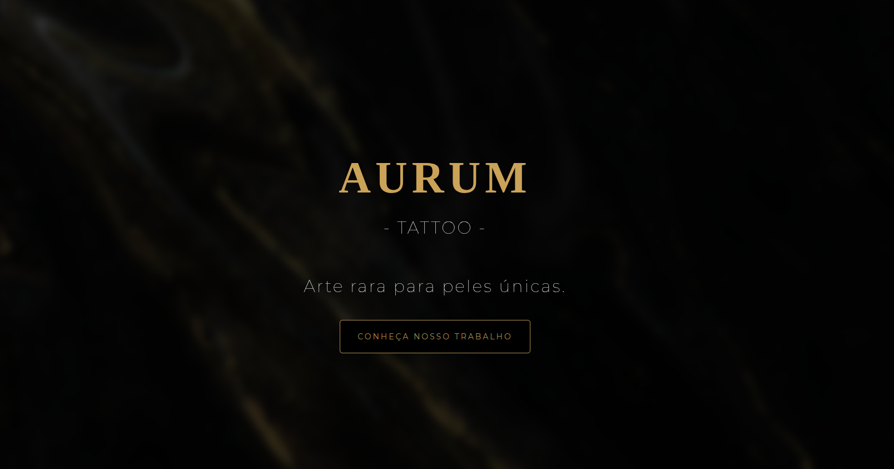

# 🖋️ Aurum Tattoo - Premium Portfolio Website

## 📖 Sobre o Projeto
O **Aurum Tattoo** é um protótipo de Landing Page (One Page) focado em elevar o posicionamento digital de estúdios de tatuagem de alto padrão. 

No mercado atual de tatuagem, a grande maioria dos artistas depende exclusivamente do Instagram como portfólio. Embora seja uma ótima ferramenta, as redes sociais sofrem com a compressão de imagens, mudanças de algoritmo e distrações constantes para o usuário.

Este projeto nasce como uma solução comercial (desenvolvido para ser vendido de forma freelance) que resolve esse problema entregando:

1. **Autoridade e Exclusividade:** Um ambiente digital próprio, com design premium (explorando a estética "boutique de luxo" em tons escuros e detalhes dourados), que passa credibilidade e valoriza o trabalho do artista.
2. **Valorização da Arte:** Exibição das tatuagens em alta qualidade, sem os limites de formato das redes sociais.
3. **Filtro de Clientes:** Um espaço dedicado para um formulário de agendamento que direciona clientes reais e orçamentos qualificados para o WhatsApp do estúdio, otimizando o tempo dos profissionais.

O projeto foi criado inicialmente com o escopo ideal para atender um estúdio pequeno (com cerca de dois artistas), funcionando como um caso de estudo prático de desenvolvimento web e, simultaneamente, como uma ferramenta real de prospecção de negócios.

---

Feito com dedicação por [Seu Nome/Seu Link do LinkedIn] 🚀
